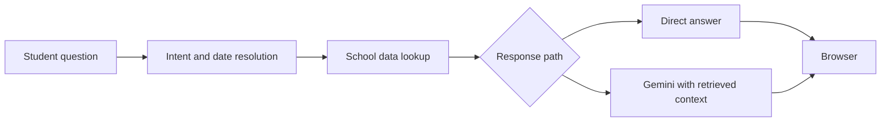

# Brentwood Chatbot

A school information assistant that turns questions about meals, timetables, and campus life into answers grounded in school data.

**[Try the live app](https://brentwoodchatbot.xyz)** · [How it works](#how-it-works) · [Run locally](#run-locally) · [Tests](#tests)

Built with **Python, Flask, SQLite, and Google Gemini**, with a plain HTML, CSS, and JavaScript interface.

## The problem

A question like “What blocks do we have tomorrow?” depends on the actual date, the school's rotating timetable, and calendar exceptions. A question about dinner can mean the menu, the serving time, or a grade-specific sign-in rule.

This project brings those sources together behind a conversational interface. The application resolves dates and retrieves records before asking a language model to explain them. Common menu and academic timetable questions have a direct response path that can avoid a model call entirely.

## What you can ask

| Question | What the application checks |
| --- | --- |
| “What's for lunch today?” | The latest locally synchronized school menu |
| “What blocks do we have tomorrow?” | Date-specific academic timetable records |
| “When does Grade 10 sign in?” | Shared boarding rules and grade-specific exceptions |
| “What events are coming up?” | Calendar records and curated event highlights |
| “Where is the library?” | Campus information and the map interface |

The interface also includes upcoming events, a campus map, progress updates while an answer is prepared, and a way to report an incorrect response.

## How it works



- **Intent routing:** common requests use rule-based matching; other requests use Gemini to identify one or more intents.
- **Data retrieval:** SQLite holds meal, timetable, and boarding records. Reviewed JSON snapshots supply school knowledge, calendar information, and featured events.
- **Answer generation:** the response path receives the relevant records and a focused prompt. Questions about personal assignments or student records are directed to MySchool.
- **Data updates:** separate synchronization scripts refresh menus, calendar information, and timetable data. Failed fetches preserve the previous snapshot.
- **Operations:** Gunicorn and Nginx serve the application. Scheduled jobs refresh data, while request limits and a shared SQLite usage store control traffic and model-call budgets.

## Engineering choices

**Use actual dates for a rotating schedule.** A weekday alone does not identify an academic block order. Timetable completion requires matching evidence from the feed and the school's published period structure; sparse or conflicting dates are left incomplete.

**Keep model output tied to retrieved facts.** The application looks up school information before generating an answer. Direct formatting handles supported menu and timetable requests, reducing both model usage and opportunities to alter the source data.

**Make failures visible.** Timeouts, failed lookups, and exhausted usage budgets have explicit response paths. Student reports and unanswered questions enter an administrator-protected feedback queue.

## Run locally

Use **Python 3.11** and a Gemini API key. Run these commands from a fresh checkout:

```bash
git clone https://github.com/Kyle1-2-3/chat-bot.git
cd chat-bot
python3 -m venv .venv
source .venv/bin/activate
python -m pip install -r requirements.txt
```

Create a local `.env` file:

```dotenv
GEMINI_API_KEY=your_api_key_here
```

Initialize the local database and start the app:

```bash
python set_up_db.py
python -m flask --app app run --host 127.0.0.1 --port 5000
```

Open <http://127.0.0.1:5000>.

`set_up_db.py` resets and seeds the school database, so use it only when initializing or intentionally rebuilding that database. A fresh database contains baseline rules; live menus and timetable records require synchronization.

To fetch the published menu, run `python sync_menus.py`. Timetable synchronization requires an authorized `MSM_ICAL_URL` in the local environment; see the [schedule setup](docs/server/schedule-sync.md) and [menu synchronization notes](docs/server/menu-sync.md). Keep keys and tokenized feed URLs out of version control.

## Tests

The Python suite covers date resolution, grade rules, retrieval, multi-intent requests, model errors, feedback, synchronization, and usage limits. The JavaScript tests cover chat progress behavior.

```bash
GEMINI_API_KEY=ci-dummy-key python -m pytest tests/ -q
node --test tests/chat-progress.test.cjs
```

The Python tests stub model responses; they do not require a paid Gemini request. Node.js 22 is used in the repository's CI configuration.

## Code map

| File or directory | Responsibility |
| --- | --- |
| [`app.py`](app.py) | Request handling, intent routing, data lookups, and responses |
| [`answer_prompts.py`](answer_prompts.py) | Prompts scoped to the retrieved result types |
| [`school_knowledge.py`](school_knowledge.py) | Search over reviewed school information |
| [`school_calendar.py`](school_calendar.py), [`school_events.py`](school_events.py) | Calendar exceptions and upcoming events |
| [`sync_menus.py`](sync_menus.py), [`sync_school_data.py`](sync_school_data.py) | Data refresh jobs |
| [`usage_limits.py`](usage_limits.py), [`feedback.py`](feedback.py) | Usage accounting and response review |
| [`static/`](static/) | Browser interface and campus map |
| [`tests/`](tests/) | Python and JavaScript regression tests |

## Scope and AI use

This is a student-built project. It is not a replacement for official school announcements or a student's personal MySchool records. Answers depend on the freshness and completeness of the configured sources, and model-generated answers can still be wrong.

AI tools were used during development. Within the application, Gemini handles intent classification and answer generation where needed; scheduling rules, data retrieval, synchronization, and usage controls are implemented in application code.

Feedback can retain submitted questions and answers, and some unanswered questions are captured automatically for review. Avoid entering personal or sensitive information.
